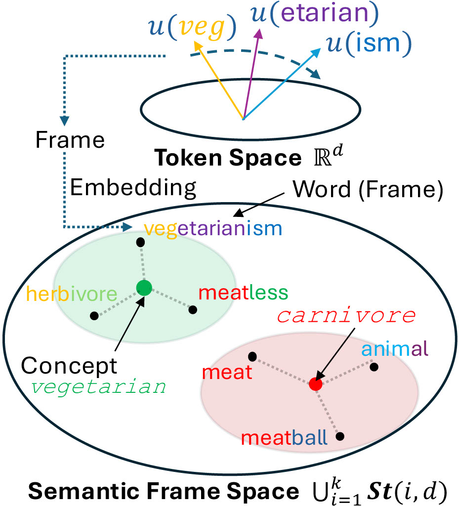

# 🎌 Frame Representation Hypothesis

> **Authors: [Pedro Valois](https://phvv.me/), [Lincon Souza](https://dblp.org/pid/196/6193.html), [Erica Kido Shimomoto](https://ericashimomoto.github.io), [Kazuhiro Fukui](https://www.cs.tsukuba.ac.jp/~kfukui/english/indexE.html)**

The Frame Representation Hypothesis is a robust framework for understanding and controlling LLMs. We use WordNet to generate concepts that can both guide the model text generation and expose biases or vulnerabilities.

[](https://arxiv.org/abs/2412.07334)
[](https://github.com/Pedrexus/frame-representation-hypothesis)

<div align="center"></div>
<!-- <div align="center"></div> -->

## 💡 Highlights

- ♻️ **Capable of dealing with multi-token words.**

- 🎧 **Can use OMW 50M word dataset to build 100,000 concepts.**

- 💪 **Tested on Llama 3.1, Gemma 2 and Phi 3 ensuring high-quality responses.**

- 🚀 **Very fast and low memory cost. Able to compute all concepts in less than a second and fit both Llama 3.1 8B Instruct and Concepts in a RTX 4090 GPU.**

## Install

1. Clone this repository.

```shell
git clone https://github.com/Pedrexus/frame-representation-hypothesis
cd frame-representation-hypothesis
```

2. Install packages.

```shell
pip install -U pip
pip install uv
uv sync
```

- We also provide a Docker image (you may need to update the CUDA version to yours)

3. Add Environment Variables

- Create a `.env` file following the `.env.example` file.
- You will need a Hugging Face Acces Token to Download models. Here is how to obtain it: https://huggingface.co/docs/hub/en/security-tokens
- You will also need to ask for permission to download each model in `models.yaml`: https://huggingface.co/docs/hub/en/models-gated
      - hugging-quants/Meta-Llama-3.1-8B-Instruct-AWQ-INT4
      - meta-llama/Meta-Llama-3.1-8B
      - ...


4. Download Models

Run `01_START_HERE.ipynb` to download all models.

## Quick Start

Each experiment in the paper is in one of the jupyter notebooks starting from 02.

## LICENSE

Our code is released under the MIT License.

## Citation

If you have any questions, please feel free to submit an issue or contact `pedro@cvlab.cs.tsukuba.ac.jp`.

If our work is useful for you, please cite as:

```
@misc{valois2024framerepresentationhypothesismultitoken,
      title={Frame Representation Hypothesis: Multi-Token LLM Interpretability and Concept-Guided Text Generation}, 
      author={Pedro H. V. Valois and Lincon S. Souza and Erica K. Shimomoto and Kazuhiro Fukui},
      year={2024},
      eprint={2412.07334},
      archivePrefix={arXiv},
      primaryClass={cs.CL},
      url={https://arxiv.org/abs/2412.07334}, 
}
```

## Star History

<!-- [](https://star-history.com/#Pedrexus/frame-representation-hypothesis&Date) -->
